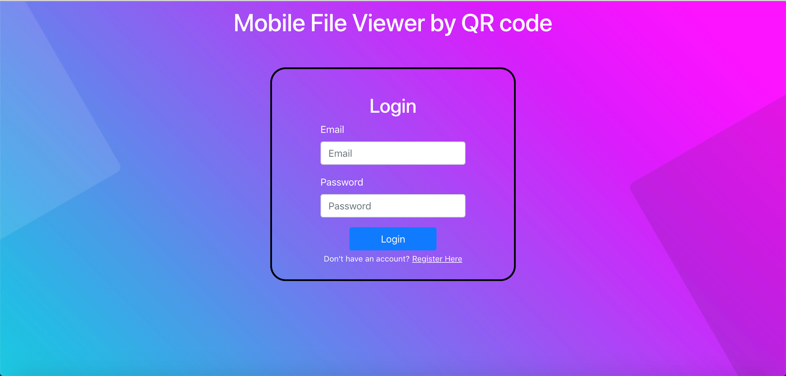
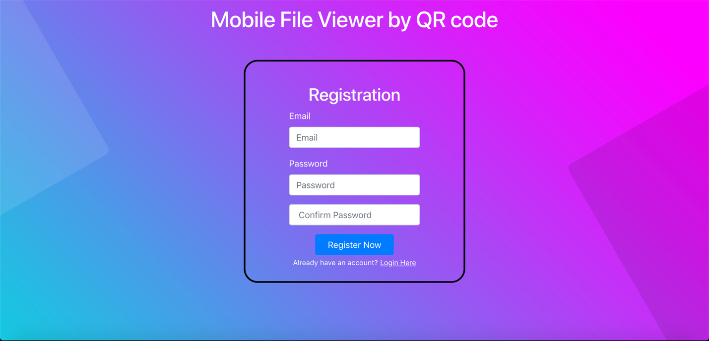
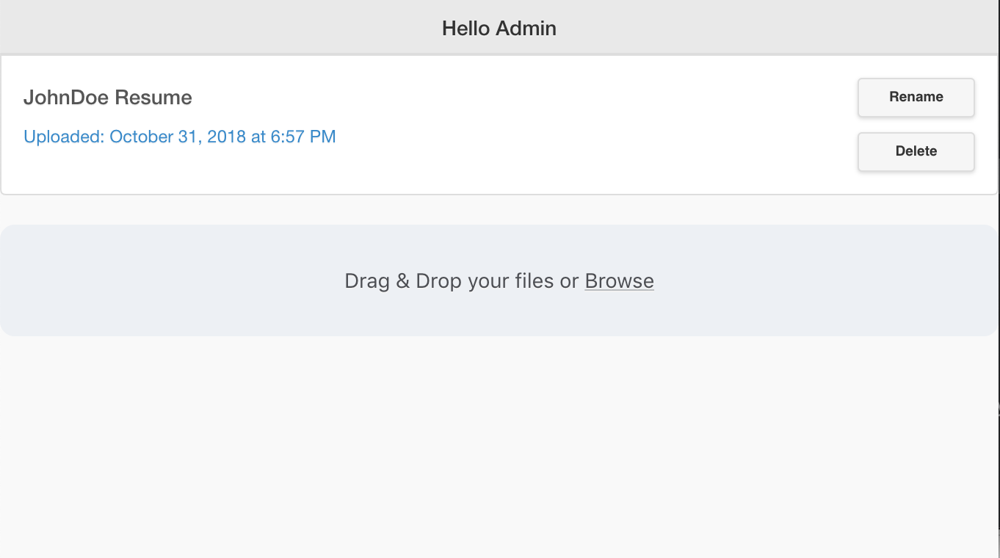

# QR-File-Sharing

This web application allows users to upload files from computer and view the uploaded files on a mobile phone by scanning the QR code generated by file on the web page. Also, for security concerns, the user will also have to input a PIN (which will be displayed after the upload) before downloading the requested file from the QR code. 

**Technologies Used:** Nodes JS, jQuery, Bootstrap 4, FilePond, and QRCode.js

### **SQL Database Schema**

### **Login Screen**

### **Registration Screen**

### **Interface to upload files**

### **Uploading a file by drag and drop**

### **QR code generates when you click on a file**

